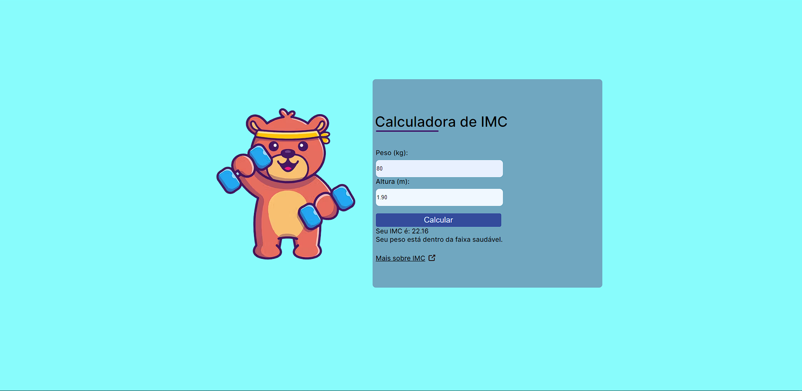

# Calculadora-IMC

This is a project aimed at studying HTML, CSS and JS. The main objective is to create a website to calculate the imc.

# Preview



## Live link:

https://matheuscamp.github.io/Calculadora-IMC/

## Instructions to run:

1. Clone the project:

```
git clone https://matheuscamp.github.io/Calculadora-IMC/
```

2. After clone open the folder:

```
Calculadora-IMC
```

3. Open the index file with browser:

```
index.html
```
